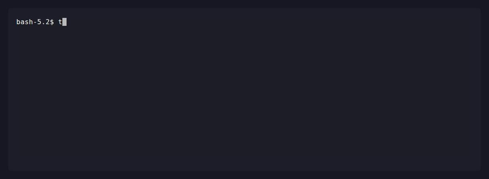
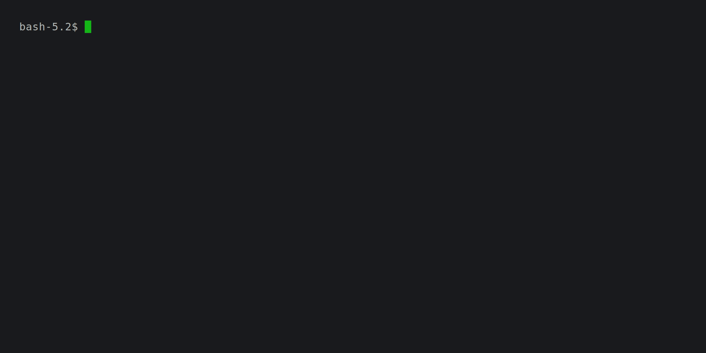

# Term Timer

<p align="center">
  <picture>
    <source type="image/svg+xml" srcset="https://raw.githubusercontent.com/Fantomas42/term-timer/develop/.github/assets/banner.svg">
    <source media="(prefers-color-scheme: dark)" srcset="https://raw.githubusercontent.com/Fantomas42/term-timer/develop/.github/assets/banner-dark.png">
    
  </picture>
</p>

Practice your speed cubing skills on your terminal, for a full 80's vibe.

[](https://github.com/fantomas42/term-timer/actions/workflows/kwalitee.yml)

Term Timer is a complete speedcubing companion that lives entirely in your
terminal. It times your solves, generates WCA-grade scrambles, talks to your
Bluetooth smart cube, reconstructs and diagnoses every solve, and trains your
CFOP cases with spaced repetition — all offline, with your data stored as
plain JSON files you fully own.

## Main Features

- Valid WCA scrambles, from 2x2x2 to 7x7x7 cubes
- Free-play and recorded solves, named sessions
- Colorful cube display in the terminal
- Native Bluetooth smart cube support (GAN Gen2/3/4, MoYu)
- Move-by-move solve reconstruction and deep CFOP analysis
- Orientation-aware analyser that detects the orientation you actually used
- FSRS spaced-repetition trainer for OLL/PLL/F2L and more
- The Doctor: per-step diagnostics with personalized, actionable advice
- Detailed statistics, trend graphs and distribution histograms
- Drill, daily scramble and scriptable practice routines
- Interactive browse/config TUIs and local HTML reports
- Fully offline, csTimer and Cubeast import

## Why a terminal timer?

Almost every modern cubing timer — csTimer, CubeDesk, Cubezila, Twisty Timer —
is a web or mobile app. They are great, but they all share the same
constraints:

- **Smart cube support is gated by the browser.** Web Bluetooth only works in
  a handful of Chromium-based browsers, and never on Firefox or Safari.
- **Your data lives in a browser or behind an account.** It sits in
  `localStorage` or a vendor cloud, and leaves when the tab does.
- **You need to be online**, or at least to trust a remote service with your
  history and your habits.

Term Timer takes the opposite path:

| | Term Timer | Typical web/mobile timer |
| --- | --- | --- |
| Runs where | Terminal, any OS | Browser / app store |
| Smart cube | **Native BLE** (GAN Gen2/3/4, MoYu) | Web Bluetooth (Chrome only) |
| Offline | **Always, 100%** | Often needs network/account |
| Your solves | **Plain JSON you own** | Browser storage / vendor cloud |
| Reconstruction | **Auto, per step, with a diagnostic engine** | Basic or premium-only |
| Orientation | **Any (UF/DF/UB…), auto-detected from your moves** | Usually fixed white-top/green-front |
| Case training | **FSRS spaced repetition** | Filtered scramble lists |
| Practice plans | **Scriptable JSON routines** | — |
| Account required | **Never** | Often |

If you live in a terminal and own a smart cube, Term Timer turns it into a
serious training rig — no tab, no login, no telemetry.

## Short demo


## Feature highlights

### Timing & scrambles

- WCA-compliant scrambles for **2x2x2 up to 7x7x7**
- 3x3x3 scrambles powered by Herbert Kociemba's optimal two-phase solver
- Free-play and recorded solves, named sessions
- Inspection countdown and a configurable metronome
- Specialized scrambles: **easy cross**, **edges oriented**, **x-cross**
- Reproducible scrambles via seed control, or supply your own scramble
- Load a batch of scrambles from a file
- A colorful — or linear, or plain — cube display right in the terminal

### Smart cube integration (the good stuff)

This is where Term Timer shines. Connect a Bluetooth cube and every solve is
captured move by move, in real time:

- Drivers for **GAN Gen2, Gen3, Gen4** and **MoYu** cubes, with the full
  encryption layer handled for you
- Live cube state and move tracking while you solve
- Automatic, accurate **solve reconstruction** — no manual entry
- Optional **gyroscope** support (`-g`): when your cube reports orientation,
  Term Timer tracks how you physically hold and rotate it during the solve,
  for an even more faithful reconstruction
- **Several cubes, one configuration**: declare each of your cubes under its
  own label and switch with `-b <label>`, each carrying its own gyroscope and
  rotation settings
- Built on `bleak`, so it works on Linux, macOS and Windows without a browser

Cubes are declared in the `[bluetooth]` section of your configuration file,
which `term-timer config` also edits:

```toml
[bluetooth]
default = "gan12"           # cube used when none is asked for
use_gyroscope = true        # global settings, overridable per cube
rotation_threshold = 75.0

[bluetooth.cubes.gan12]
name = "GAN 12 ui FreePlay"
address = "AA:BB:CC:DD:EE:FF"

[bluetooth.cubes.weilong]
name = "MoYu WeiLong v10 AI"
address = "11:22:33:44:55:77"
use_gyroscope = false       # this cube alone ignores its gyroscope
rotation_threshold = 60.0
```

`-b` then selects a cube for one session: `-b weilong` takes that cube,
`-b auto` scans for any cube even one never declared, `-b AA:BB:...` dials an
address directly, and a bare `-b` runs without a cube. Leave `default` empty
and Term Timer scans, favouring the cubes you declared: power on the one you
want to solve on, it is the one that answers.

### Solve analysis & diagnostics

Every recorded solve (especially with a smart cube) gets a full breakdown:

- **CFOP step detection** — Cross, F2L slot by slot, OLL, PLL — with the
  recognized case for each step (`cf4op` analyser by default; `cfop`, `lbl`
  and `raw` analysers also available)
- **Advanced F2L recognition** — each of the four slots is tracked
  individually and its case identified, including tricky and non-standard
  insertions that most reconstructors miss
- **Orientation freedom** — solve in *your* favorite orientation (UF, DF, UB,
  …) and the analyser still recognizes every case correctly. Even better, the
  reconstructor **figures out which orientation you actually used** from your
  moves (auto by default), instead of forcing the white-on-top / green-front
  assumption that trips up other tools. This is a genuinely unique capability
- Per-step and overall **TPS**, move count (HTM/QTM), and **recognition time**
- A **fluency** score (0–100) measuring how rhythmic and smooth your
  execution is
- **Highlights** that automatically call out the nice moments of a solve
  (optimal cross, fast PLL, buttery-smooth fluency…)
- Optional graphs: **time scatter**, **TPS**, **fluency**, **recognition**
- **The Doctor** — a diagnostic engine that inspects efficiency, execution,
  rotations and recognition at both the global and per-step level, rates each
  issue by severity and estimated time impact, and turns the result into
  personalized improvement advice

### Training that actually schedules your learning

The trainer is built for smart-cube practice and uses **FSRS** (Free Spaced
Repetition Scheduler) by default — the same family of algorithms behind modern
flashcard apps. Instead of just feeding you random case scrambles, it tracks
your mastery of each OLL/PLL (and more) case and schedules reviews when you are
about to forget them.

- Train **Cross, easy-cross, x-cross, F2L, advanced F2L, OLL, PLL, last layer**
- FSRS picks what to review, introduces new cases at a controlled pace, and
  surfaces a session focus (exploration / learning / review / maintenance)
- Solutions reveal automatically while a case is still being learned
- Restrict the pool to the **oldest**, **slowest**, a **family/group filter**,
  or specific cases — FSRS keeps updating cards either way
- Card state lives inside the same training JSON file, fully backward
  compatible

### Practice, your way

- **Drill** — repeat a single algorithm (e.g. `R U R' U'`) to build muscle
  memory, with reps, duration, countdown and metronome
- **Daily** — a fixed scramble of the day everyone can compare on, with review
  and summary
- **Routine** — script a full practice session in JSON (warm-up drills,
  targeted training, timed solves) and run it in one command; ready-made
  routines ship in `docs/routines/`

### Statistics & visualization

- Session statistics with **best, mean, median, Ao5, Ao12, deviation** and more
- Trend graphs and distribution histograms, right in the terminal
- DNF and +2 handling **audited against the csTimer source code** for
  faithful, comparable numbers
- CFOP case statistics across your sessions (`cfop` command)
- **Browse** sessions and solve details in an interactive Textual TUI
- **Serve** rich HTML reports of your solves locally

### Data ownership & interoperability

- Everything is stored as **plain JSON** on your disk
- **Import** from csTimer and Cubeast
- **Merge** sessions
- Interactive **config** editor (Textual TUI)
- A `bt-info` utility to inspect your Bluetooth cube

## Examples usage

Start timing 3x3x3 solves :

```console
term-timer solve
```

Start timing a recorded session (a Bluetooth cube is used automatically when
one is configured; pass `-b` to disable it) :

```console
term-timer solve -u morning
```

Own several cubes? Declare them once and pick one per session, without ever
editing the configuration again :

```console
term-timer solve -b weilong          # a cube declared in the configuration
term-timer solve -b auto             # scan, take whatever cube answers
term-timer solve -b AA:BB:CC:DD:EE:FF  # a cube you are trying out
```

Start timing 2 solves of 4x4x4 in free-play :

```console
term-timer solve -c 4 -f 2
```

Start timing with an easy cross and 15 seconds of inspection :

```console
term-timer solve -ec -i 15
```

Train your OLL cases with FSRS spaced repetition :

```console
term-timer train -s oll
```

Drill the sexy move 20 times :

```console
term-timer drill "R U R' U'" -t 20
```

Run today's daily scramble :

```console
term-timer daily
```

Run a ready-made practice routine :

```console
term-timer routine docs/routines/daily.json
```

Show statistics on recorded solves :

```console
term-timer stats
```

Show the tendencies graph on recorded solves :

```console
term-timer graph
```

Show the last ten recorded solves of 7x7x7 :

```console
term-timer list 10 -c 7
```

Browse your sessions interactively :

```console
term-timer browse
```

## Installation

``` console
pip install term-timer
```

### Development installation

`term-timer` and `cubing-algs` are tightly coupled during development.
Install the live develop branch of `cubing-algs` first to override the
pinned PyPI version:

```console
pip install git+https://github.com/Fantomas42/cubing-algs@develop
pip install -e .[dev]
```

## Acknowledgments

I would like to express my sincere gratitude to the developers of the
following projects, without which Term Timer would not have been possible:

* [Herbert Kociemba's RubiksCube-TwophaseSolver][1] for the highly efficient
  Two-Phase algorithm implementation that enables optimal 3x3x3 cube
  scrambles.

* [trincaog's magiccube][2] for providing an excellent foundation for cube
  modeling and manipulation.

* [afedotov's gan-web-bluetooth][3] for his clean and well-structured
  implementation of the GAN Bluetooth cubes.

Their outstanding work and contributions to the Rubik's Cube programming
community have been invaluable to this project.

[1]: https://github.com/hkociemba/RubiksCube-TwophaseSolver
[2]: https://github.com/trincaog/magiccube/
[3]: https://github.com/afedotov/gan-web-bluetooth/

## Demos







## Help

### General

```console
Usage: term-timer [-h]
                  {daily,solve,train,drill,routine,reset,browse,detail,edit,
                   delete,list,index,stats,graph,cfop,serve,scramble,import,
                   merge,config}
                  ...

Speed cubing timer on your terminal.

Positional Arguments:
    daily (da, y)       Practice the scramble of the day.
    solve (sw, t)       Start the timer and record solves.
    train (tr, w)       Start training your OLL/PLL skills.
    drill (dl, dr)      Drill an algorithm repeatedly.
    routine (ro, n)     Run a daily practice routine from a config file.
    reset (rs, q)       Reset the state of the Bluetooth cube.
    browse (br, b)      Browse solve sessions interactively.
    detail (dt, d)      Display detailed information about solves.
    edit (ed, e)        Edit solves' flag or comment.
    delete (rm, r)      Delete solves.
    list (ls, l)        Display recorded solves.
    index (ix, x)       List sessions.
    stats (st, s)       Display statistics.
    graph (gr, g)       Display trend graph.
    cfop (op, c)        Display CFOP cases.
    serve (se, h)       Serve solves in HTML.
    scramble (sc, z)    Generate scrambles for chill cubing.
    import (im, i)      Import external solves.
    merge (mg, j)       Merge multiple sessions into one.
    config (cf, k)      Edit configuration settings.

Options:
  -h, --help            Show this help message and exit.

Have fun cubing !
```

### Timer

```console
Usage: term-timer solve [-h] [-p] [-o ORIENTATION] [-b] [-g] [-m METHOD] [-j]
                        [-s] [-a] [-e] [-t] [-v] [-z] [-w] [-c CUBE]
                        [-u SESSION] [-f] [-i SECONDS] [-k TEMPO] [-ec] [-eo]
                        [-xc] [-n ITERATIONS] [-r SEED] [-x SCRAMBLE]
                        [-l FILE]
                        [SOLVES]

Start the speed cubing timer to record and time your solves.

Positional Arguments:
  SOLVES                Specify the number of solves to be done.
                        Default: Infinite.

Cube:
  -p, --hide-cube       Hide the cube in its scrambled state.
  -o ORIENTATION, --orientation ORIENTATION
                        Set the cube orientation used. Default: auto.

Bluetooth:
  -b [CUBE], --bluetooth [CUBE]
                        Select the Bluetooth-connected cube, by label or
                        address. "auto" scans for any cube, "off" solves
                        without one.
  -g, --enable-gyroscope
                        Enable the cube's gyroscope, whatever the cube
                        configures.
  -m METHOD, --method METHOD
                        Set the method of analyse used. Default: cf4op.
  -j, --hide-steps      Hide completed steps during the solve.
  -s, --hide-reconstruction
                        Hide the reconstruction of the solve.
  -a, --hide-highlights
                        Hide highlights after analysis.
  -e, --hide-doctor     Hide doctor main diagnostic after analysis.
  -t, --show-time-graph
                        Show the time scatter graph of the solve.
  -v, --show-tps-graph  Show the TPS graph of the solve.
  -z, --show-fluency-graph
                        Show the fluency graph of the solve.
  -w, --show-recognition-graph
                        Show the recognition graph of the solve.

Session:
  -c CUBE, --cube CUBE  Set the size of the cube (from 2 to 7). Default: 3.
  -u SESSION, --session SESSION
                        Name of the session for solves. Default: None.
  -f, --free-play       Disable recording of solves.

Timer:
  -i SECONDS, --countdown SECONDS
                        Set the inspection countdown in seconds. Default: 0.0.
  -k TEMPO, --metronome TEMPO
                        Set a metronome beep at a tempo in seconds. Default: 0.0.

Scramble:
  -ec, --easy-cross     Set the scramble with an easy cross.
  -eo, --edges-oriented
                        Set the scramble with edges oriented.
  -xc, --x-cross        Set the scramble with a x-cross.
  -n ITERATIONS, --iterations ITERATIONS
                        Set the number of random moves. Default: Auto.
  -r SEED, --seed SEED  Set a seed for repeatable scrambles. Default: None.
  -x SCRAMBLE, --scramble SCRAMBLE
                        Set the scramble to use for solving. Default: None.
  -l FILE, --scrambles-file FILE
                        Load scrambles from a file. Default: None.
```

### Trainer

```console
Usage: term-timer train [-h] [-s STEP] [-l] [-v] [-m N]
                        [-i FILTER [FILTER ...]] [-c [CASES ...] | -d [N] | -t
                        [N] | -n [N]] [-p] [-o ORIENTATION] [-b] [-g] [-f]
                        [-k TEMPO] [-r SEED]
                        [TRAININGS]

Start the trainer to improve your skills.

Positional Arguments:
  TRAININGS             Number of trainings to be done. Default: Infinite.

Options:
  -s STEP, --step STEP  Training mode: cross, ecross, xcross, f2l, af2l, oll,
                        pll or ll. Default: oll.
  -l, --list            List all available cases with their statistics.
  -v, --solution        Always show the main solution of the case.

Case Selection:
  By default, cases are selected by FSRS.
  --oldest, --slowest and --filter restrict the pool while keeping FSRS active;
  --cases and --random disable FSRS selection (cards are still updated).

  -m N, --new-cases N   Maximum new cases to introduce per session. Default: 5.
  -i FILTER [FILTER ...], --filter FILTER [FILTER ...]
                        Filter cases by family or group (e.g. Dot, Cross, OCLL).
  -c [CASES ...], --cases [CASES ...]
                        Practice specific cases by name.
  -d [N], --oldest [N]  Select N cases least recently practiced. Default N: 5.
  -t [N], --slowest [N]
                        Select N cases with worst average of 12. Default N: 5.
  -n [N], --random [N]  Select N cases randomly.

Cube:
  -p, --hide-cube       Hide the cube in its scrambled state.
  -o ORIENTATION, --orientation ORIENTATION
                        Set the cube orientation used. Default: DF.

Bluetooth:
  -b [CUBE], --bluetooth [CUBE]
                        Select the Bluetooth-connected cube, by label or
                        address. "auto" scans for any cube, "off" solves
                        without one.
  -g, --enable-gyroscope
                        Enable the cube's gyroscope, whatever the cube
                        configures.

Session:
  -f, --free-play       Disables saving and FSRS scheduling.

Timer:
  -k TEMPO, --metronome TEMPO
                        Set a metronome beep at a tempo in seconds. Default: 0.0.

Scramble:
  -r SEED, --seed SEED  Set a seed for repeatable scrambles. Default: None.
```

## Origin Story

While I was diligently working on my personal CFOP databases, which can be
accessed at [https://cubing.fache.fr/](https://cubing.fache.fr/), I
encountered the necessity for a high-quality scrambling tool for a 3x3
Rubik's Cube. This tool was essential for the development of an innovative
type of computer solver for the 3x3 cube.

Once I successfully developed this scrambler, it occurred to me that it
would be a regrettable oversight not to capitalize on this momentum by
creating a timing application based on the scrambler's functionality.

Having produced a straightforward prototype and finding the program to be
quite satisfactory, I further concluded that withholding such a useful tool
from the community would constitute another regrettable oversight.
